# Eletro Store - Flutter E-commerce Template

## Overview  
*Eletro Store* is a premium Flutter template designed for modern e-commerce applications, featuring 14 meticulously crafted screens. Tailored with a sleek, minimalist aesthetic for the European market, this project showcases my skills in mobile app development with Flutter. It’s optimized for performance using Skia, fully customizable, and ready to launch on Android and iOS.

## Features  
- **14 Ready-to-Use Screens**: Includes Splash, Login, Register, Home, Store, Product Detail, Cart, Checkout, Success, Profile, Notifications, Order Details, Support, and Main Screen.  
- **European Design**: Clean, elegant style appealing to sophisticated users across Europe.  
- **Smooth Animations**: Built with Fade and Scale Transitions for a premium user experience.  
- **Performance**: Optimized with Skia rendering engine for seamless operation.  
- **Customizable**: Easily adaptable with assets and API integration.

   ## Screenshots  
Below are some previews of *Eletro Store* in action:  
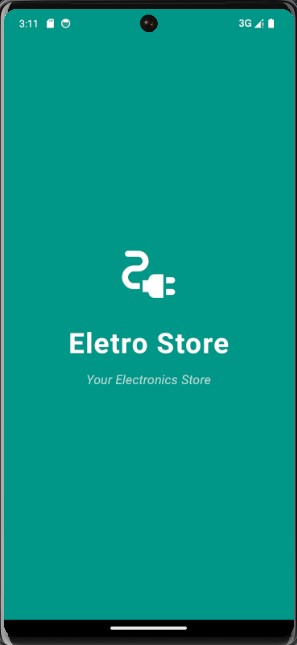 
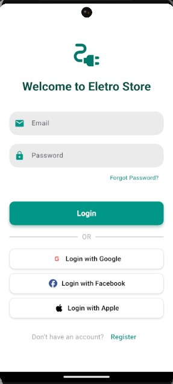 
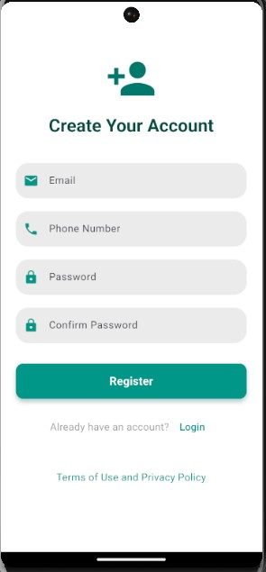
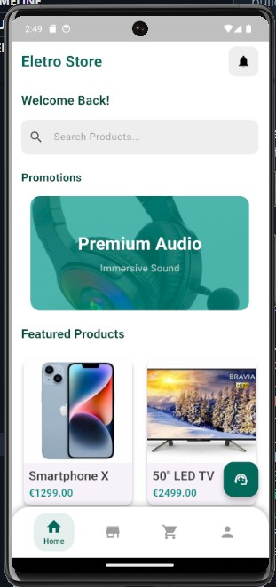    
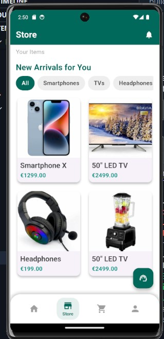  
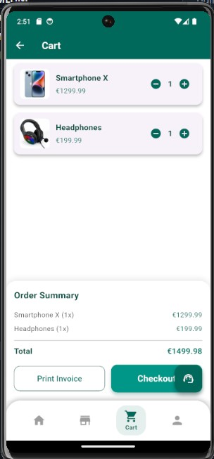 
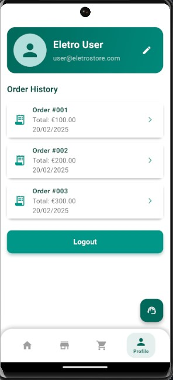
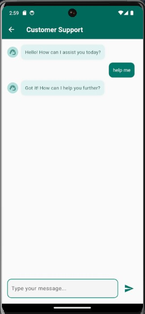 
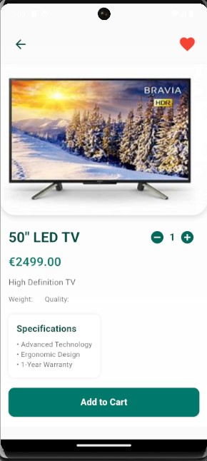 
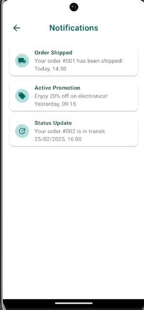 
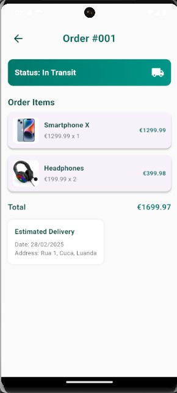.
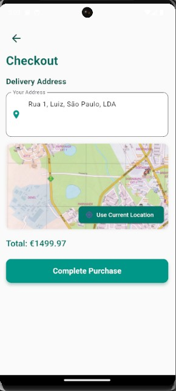 
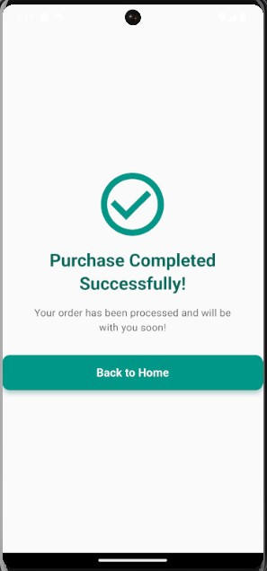 
 

## Technical Details  
- **Framework**: Flutter 3.6.2+  
- **Platforms**: Android (minSdk 21) and iOS  
- **Dependencies**: `provider`, `carousel_slider`, `fluttertoast`, and more (see `pubspec.yaml` in the full project).  
- **Application ID**: `com.petrohost.eletrostore`  

## Purpose  
This project is my debut premium template, crafted to demonstrate my expertise in Flutter development and UI/UX design. It’s submitted to CodeCanyon as a complete e-commerce solution for developers and businesses targeting Europe.

## How to Run  
1. Clone this repository:
   git clone https://github.com/seniamaraa/eletro-store.git
   2. Install dependencies:
      flutter pub get
   3. Run the app:
      flutter run --release
      

## Contact  
- **Author**: Seniamara Benedito 
- **Email**: senimaraa@gmail.com  
- **LinkedIn**: (https://www.linkedin.com/in/seniamara-benedito-04630731b?utm_source=share&utm_campaign=share_via&utm_content=profile&utm_medium=android_app)

## License  
This is a preview for portfolio purposes. The full template is available exclusively on CodeCanyon upon approval.
